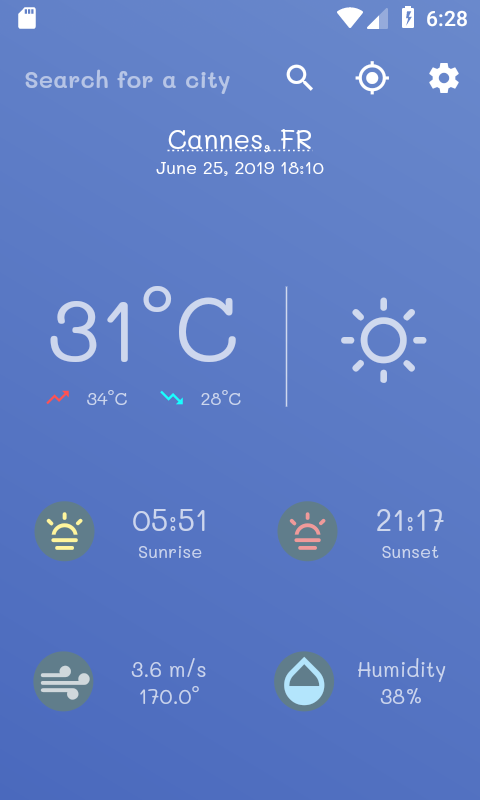
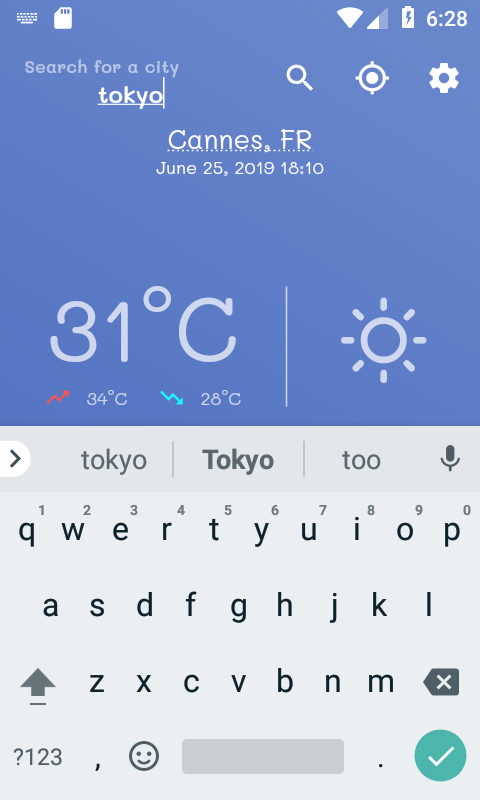
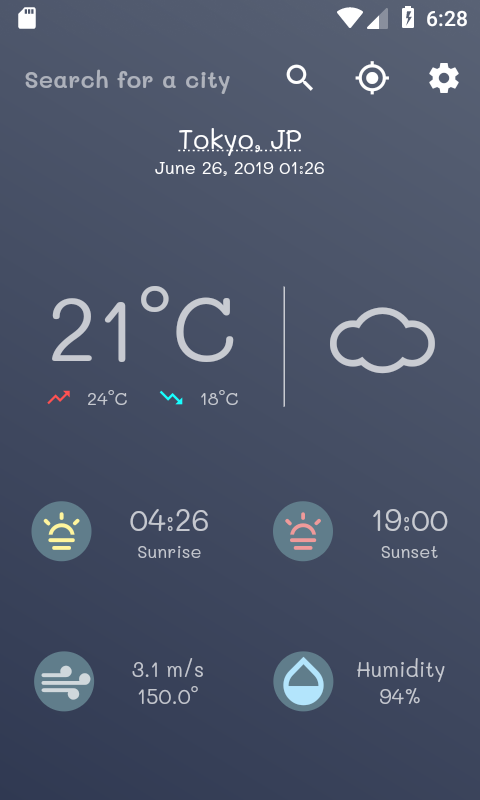
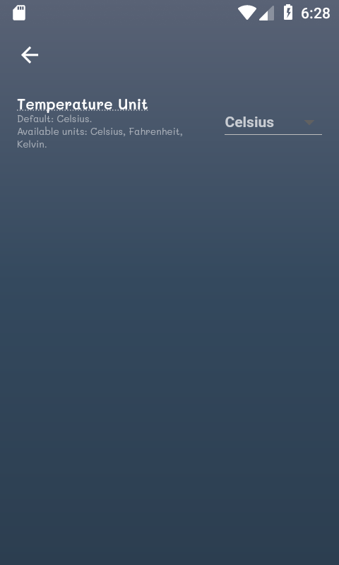
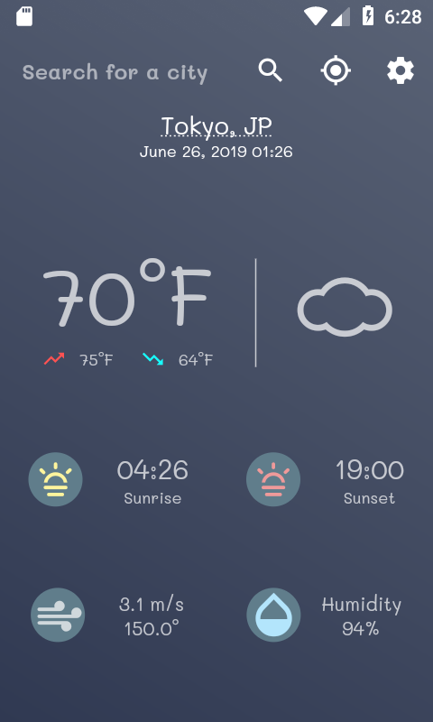
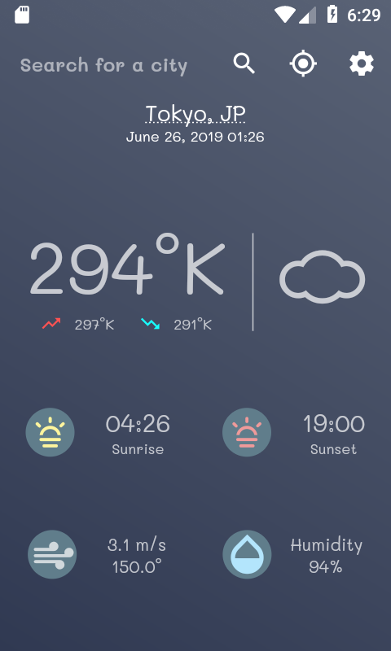

# Weatheria ☀️

### A beautiful and minimalistic weather app made with Dart, Flutter and Redux.

*This project was part of an attempt to learn Dart and Flutter.*

***Please don't look at the code. :)***

|   |   |   |
|---|---|---|
||||
||||

 

</img>

## Features

 * Get weather statistics by city name or current location.
    * Temperature, Sunrise & Sunset, Wind speed and direction, Humidity.
  
 * Temperature unit conversion (Kelvin, Celsius, Fahrenheit).